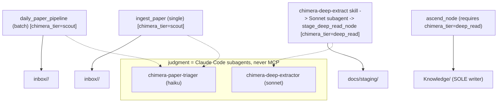

# Chimera Lite — Architecture (generated)

Generated by `scripts/gen_architecture_diagram.py`. Do not hand-edit — regenerate at every phase seal. Describes actual code as it stands; never aspiration.

## MCP tool inventory

### chimera-papers

- `arxiv_miner`
- `check_task_status`
- `convert_pdf_to_md`
- `daily_paper_pipeline`
- `fetch_paper`
- `get_paper_markdown`
- `ingest_paper`
- `stage_deep_read_node`
- `write_scout_card`

### chimera-vault

- `apply_link_patch`
- `ascend_node`
- `create_node`
- `link_nodes`
- `load_criteria`
- `obsidian_graph_query`
- `read_vault_file`
- `search_vault`
- `search_vault_attribute`
- `vault_query`
- `write_result`

## Subagent -> model pins

| agent | model |
|---|---|
| chimera-breadth-reducer | sonnet |
| chimera-deep-extractor | sonnet |
| chimera-paper-classifier | sonnet |
| chimera-paper-triager | haiku |
| chimera-repo-scout | haiku |
| chimera-sprint-executor | sonnet |
| chimera-verbatim-verifier | sonnet |
| chimera-verify-runner | haiku |

## Ingestion / write paths

Judgment is externalized out of the MCP layer entirely (Phase L.B): the MCP servers make NO LLM call. Triage judgment = `chimera-paper-triager` (Haiku); deep-read judgment = `chimera-deep-extractor` (Sonnet). Both are Claude Code subagents, never MCP-internal.

