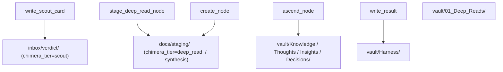

# Chimera Lite — Dataflow Map (generated)

Generated by `scripts/gen_architecture_diagram.py`. Do not hand-edit — regenerate at every phase seal. Every write edge below is DERIVED from a reference chain in source; none is asserted by hand. Describes actual code as it stands; never aspiration.

## MCP tool inventory

### chimera-papers

- `analyze_paper_data`
- `arxiv_miner`
- `check_task_status`
- `convert_pdf_to_md`
- `daily_paper_pipeline`
- `fetch_paper`
- `get_paper_markdown`
- `ingest_paper`
- `stage_deep_read_node`
- `write_scout_card`

### chimera-vault

- `apply_link_patch`
- `ascend_node`
- `create_node`
- `link_nodes`
- `load_criteria`
- `obsidian_graph_query`
- `read_vault_file`
- `search_vault`
- `search_vault_attribute`
- `vault_query`
- `write_result`

## Subagent -> model pins

| agent | model |
|---|---|
| chimera-breadth-reducer | sonnet |
| chimera-deep-extractor | sonnet |
| chimera-paper-classifier | sonnet |
| chimera-paper-triager | haiku |
| chimera-repo-scout | haiku |
| chimera-sprint-executor | sonnet |
| chimera-verbatim-verifier | sonnet |
| chimera-verify-runner | haiku |

## Write surfaces (derived)

Judgment is externalized out of the MCP layer entirely (Phase L.B): the MCP servers make NO LLM call. Subagents are spawned by Claude Code SKILLS, never by an MCP tool — so no tool-to-subagent edge is drawn here, because none exists in code.

| destination | writer | anchor | reached by |
|---|---|---|---|
| `inbox/<verdict>/  [chimera_tier=scout]` | `write_knowledge_node` | `mcp-servers/chimera-papers/ports/vault/vault_note_writer.py:31` | `write_scout_card` |
| `docs/staging/  [chimera_tier=deep_read \| synthesis]` | `create_staging_node` | `mcp-servers/chimera-papers/staging_service.py:61` | `stage_deep_read_node`, `create_node` |
| `<vault>/Knowledge\|Thoughts\|Insights\|Decisions/` | `_promote_write` | `mcp-servers/chimera-papers/staging_service.py:117` | `ascend_node` |
| `<vault>/Harness/` | `write_result` | `mcp-servers/chimera-papers/result_service.py:102` | `write_result` |
| `<vault>/01_Deep_Reads/` | `write_deep_read_node` | `mcp-servers/chimera-papers/ports/vault/vault_note_writer.py:47` | **ORPHANED — no MCP tool reaches this** |

### Derived reference chains

Each edge above, with the chain that proves it:

- `write_scout_card` -> `inbox/<verdict>/  [chimera_tier=scout]` via `write_scout_card -> write_knowledge_node`
- `stage_deep_read_node` -> `docs/staging/  [chimera_tier=deep_read | synthesis]` via `stage_deep_read_node -> create_staging_node`
- `create_node` -> `docs/staging/  [chimera_tier=deep_read | synthesis]` via `create_node -> create_staging_node`
- `ascend_node` -> `<vault>/Knowledge|Thoughts|Insights|Decisions/` via `ascend_node -> _promote_write`
- `write_result` -> `<vault>/Harness/` via `write_result`

- `inbox/<verdict>/  [chimera_tier=scout]` — Scout tier. Never auto-promoted; ascension is a separate operator action.
- `docs/staging/  [chimera_tier=deep_read | synthesis]` — Review gate. Nothing here is live vault content until promoted or ascended.
- `<vault>/Knowledge|Thoughts|Insights|Decisions/` — Shared write mechanics for promote_node + ascend_node. promote_node REFUSES chimera_tier=deep_read, which is what makes ascend_node the sole writer of Knowledge/ (structural, not conventional).
- `<vault>/Harness/` — W1 verdicts + W2 breadth maps. Review area, not the committed tier.
- `<vault>/01_Deep_Reads/` — Oligo-era surface; its only caller is the retired OpticsService.irradiate path.

```mermaid
flowchart TD
    inbox_dest["inbox/verdict/  (chimera_tier=scout)"]
    tool_write_scout_card["write_scout_card"] --> inbox_dest
    staging_dest["docs/staging/  (chimera_tier=deep_read  /  synthesis)"]
    tool_stage_deep_read_node["stage_deep_read_node"] --> staging_dest
    tool_create_node["create_node"] --> staging_dest
    committed_dest["vault/Knowledge / Thoughts / Insights / Decisions/"]
    tool_ascend_node["ascend_node"] --> committed_dest
    harness_dest["vault/Harness/"]
    tool_write_result["write_result"] --> harness_dest
    deep_reads_legacy_dest["vault/01_Deep_Reads/"]
```
