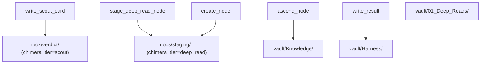

# Chimera Lite — Architecture Map (generated)

Generated by `scripts/gen_architecture_diagram.py`. Do not hand-edit — regenerate at every phase seal. Describes actual code as it stands; never aspiration.

## Coverage — 2 of 3 layers verified (PARTIAL)

**This map is deliberately incomplete, and states so.** A partial map presented as whole is the failure mode this artifact already suffered once: its flow section was a hardcoded literal that reproduced byte-for-byte while asserting write paths L.B.2 had removed (`docs/sprints/phase-L.B/L.B.5.md`, amendment 2026-08-03). Coverage is therefore rendered before any content.

| layer | status | what that means |
|---|---|---|
| 1. Dataflow / write surfaces | **VERIFIED** | Every write edge is derived from a reference chain in source and asserted by `tests/test_architecture_dataflow.py`; an unreached surface renders ORPHANED. |
| 2. Invariant conformance (canonical I-ids) | **VERIFIED** | Each invariant in the canonical is adjudicated by a mechanical verifier below. An invariant with no possible mechanical check reports UNCHECKABLE with the reason, never a silent pass. Compliance detail: ENFORCEMENT_DEBT.md. |
| 3. Skill / context layer | **OUT OF SCOPE** | Which skill invokes which tool and spawns which subagent is NOT mapped, and is not pursued: skill bodies name tools in red lines precisely to FORBID them, so any derivation short of real intent-parsing would mint edges asserting the opposite of the source's meaning. Declared here so the map's edge is legible, not as pending work. |

Derived this run: **5 write surfaces**, **5 write edges**, **22 MCP tools**, **8 pinned subagents**. Not derived: **14 invariants** (layer 2) and the **17 skills / 8 agents** call graph (layer 3).

## MCP tool inventory

### chimera-papers

- `analyze_paper_data`
- `arxiv_miner`
- `check_task_status`
- `convert_pdf_to_md`
- `daily_paper_pipeline`
- `fetch_paper`
- `get_paper_markdown`
- `ingest_paper`
- `mineru_sidecar`
- `stage_deep_read_node`
- `write_scout_card`

### chimera-vault

- `apply_link_patch`
- `ascend_node`
- `create_node`
- `link_nodes`
- `load_criteria`
- `obsidian_graph_query`
- `read_vault_file`
- `search_vault`
- `search_vault_attribute`
- `vault_query`
- `write_result`

## Subagent -> model pins

| agent | model |
|---|---|
| chimera-breadth-reducer | sonnet |
| chimera-deep-extractor | sonnet |
| chimera-paper-classifier | sonnet |
| chimera-paper-triager | haiku |
| chimera-repo-scout | haiku |
| chimera-sprint-executor | sonnet |
| chimera-verbatim-verifier | sonnet |
| chimera-verify-runner | haiku |

## Write surfaces (derived)

Judgment is externalized out of the MCP layer entirely (Phase L.B): the MCP servers make NO LLM call. Subagents are spawned by Claude Code SKILLS, never by an MCP tool — so no tool-to-subagent edge is drawn here, because none exists in code.

| destination | writer | anchor | reached by |
|---|---|---|---|
| `inbox/<verdict>/  [chimera_tier=scout]` | `write_knowledge_node` | `mcp-servers/chimera-papers/ports/vault/vault_note_writer.py:31` | `write_scout_card` |
| `docs/staging/  [chimera_tier=deep_read]` | `create_staging_node` | `mcp-servers/chimera-papers/staging_service.py:61` | `stage_deep_read_node`, `create_node` |
| `<vault>/Knowledge/` | `_ascend_write` | `mcp-servers/chimera-papers/staging_service.py:132` | `ascend_node` |
| `<vault>/Harness/` | `write_result` | `mcp-servers/chimera-papers/result_service.py:133` | `write_result` |
| `<vault>/01_Deep_Reads/` | `write_deep_read_node` | `mcp-servers/chimera-papers/ports/vault/vault_note_writer.py:47` | **ORPHANED — no MCP tool reaches this** |

### Derived reference chains

Each edge above, with the chain that proves it:

- `write_scout_card` -> `inbox/<verdict>/  [chimera_tier=scout]` via `write_scout_card -> write_knowledge_node`
- `stage_deep_read_node` -> `docs/staging/  [chimera_tier=deep_read]` via `stage_deep_read_node -> create_staging_node`
- `create_node` -> `docs/staging/  [chimera_tier=deep_read]` via `create_node -> create_staging_node`
- `ascend_node` -> `<vault>/Knowledge/` via `ascend_node -> _ascend_write`
- `write_result` -> `<vault>/Harness/` via `write_result`

- `inbox/<verdict>/  [chimera_tier=scout]` — Scout tier. Never auto-promoted; ascension is a separate operator action.
- `docs/staging/  [chimera_tier=deep_read]` — Review gate, KNOWLEDGE ONLY. Nothing here is live vault content until ascended. T/I/D are refused: their bodies are Architect-authored (I0.5).
- `<vault>/Knowledge/` — The one committed-tier writer, called only by ascend_node, refusing every destination but Knowledge/. promote_node (T/I/D) was retired 2026-08-11 — no code path writes Thoughts/Insight/Decision; the Architect authors those in Obsidian.
- `<vault>/Harness/` — W1 verdicts + W2 breadth maps. Review area, not the committed tier.
- `<vault>/01_Deep_Reads/` — Oligo-era surface; its only caller is the retired OpticsService.irradiate path.

```mermaid
flowchart TD
    inbox_dest["inbox/verdict/  (chimera_tier=scout)"]
    tool_write_scout_card["write_scout_card"] --> inbox_dest
    staging_dest["docs/staging/  (chimera_tier=deep_read)"]
    tool_stage_deep_read_node["stage_deep_read_node"] --> staging_dest
    tool_create_node["create_node"] --> staging_dest
    committed_dest["vault/Knowledge/"]
    tool_ascend_node["ascend_node"] --> committed_dest
    harness_dest["vault/Harness/"]
    tool_write_result["write_result"] --> harness_dest
    deep_reads_legacy_dest["vault/01_Deep_Reads/"]
```

## Layer 2 — invariant conformance (1 PARTIAL, 5 PASS, 8 UNCHECKABLE, 1 VIOLATED)

The invariants are a HUMAN-AUTHORED SSOT: `docs/ARCHITECTURE/INVARIANTS.md` owns them, and this generator may only ever implement VERIFIERS against it — never author, restate, or override a rule (CLAUDE.md drift rule). Rule ids, titles, and declared tiers are re-parsed from that file on every run, so those columns are a pointer that cannot drift, not a copy that can.

**`declared` is the rule's claim about itself; `verdict` is this map's mechanical finding.** Where the two disagree, the verdict is the one backed by a check. A rule with no possible mechanical check reports `UNCHECKABLE` with the reason — never a silent pass.

| rule | invariant | declared | verdict |
|---|---|---|---|
| I0.1 | Human-Time Supremacy | Tier 0 | **PASS** |
| I0.2a | Provenance Load-Bearing | Tier 0 | **PASS** |
| I0.2b | Provenance Load-Bearing | Tier 0 | **VIOLATED** |
| I0.3 | Verification Tier-Separation | Tier 0 | **UNCHECKABLE** |
| I0.4 | Append-Only with Supersession | Tier 0 | **UNCHECKABLE** |
| I0.5 | Judgment vs Evidence Authorship | Tier 0 | **PARTIAL** |
| I1.1 | MCP Primitives Make No Judgment | Tier 1 | **PASS** |
| I1.2 | Staging Gate Universality | Tier 1 | **PASS** |
| I1.3 | Proof Graph, Not Computation Graph | Tier 1 | **UNCHECKABLE** |
| I1.4 | Three Consumption Routes, Equal Friction | Tier 1 | **UNCHECKABLE** |
| I1.5 | Tier Existence | Tier 1 | **PASS** |
| I2.1 | Node Types and Tier Values | Tier 2 | **UNCHECKABLE** |
| I2.2 | Edge Types | Tier 2 | **UNCHECKABLE** |
| I2.3 | Dual-Clock Implementation | Tier 2 | **UNCHECKABLE** |
| I2.4 | Criteria Externalization | Tier 2 | **UNCHECKABLE** |

### Verifier findings

**I0.1 — PASS**

- *Checked:* Tested which entry points reach `_ascend_write` (the only committed-tier write mechanic): registered MCP tools vs background/scheduled task entry points.
- *Finding:* `_ascend_write` is reached only by human-invoked MCP tool(s): `ascend_node`. No background/scheduled path reaches it.

**I0.2a — PASS**

- *Checked:* AST-extracted `write_result` and tested whether its `verdict` parameter is constrained to `Literal["V","P","U"]` (structural) or accepts an arbitrary string (advisory).
- *Finding:* `verdict` is schema-constrained: 'verdict: Literal["V", "P", "U"] | None = None,'. A malformed tag is rejected by pydantic at the JSON-RPC boundary before the handler body runs. This covers WELL-FORMEDNESS ONLY — see R5b for whether the tag is earned.

**I0.2b — VIOLATED**

- *Checked:* Traced every use of the support-bearing edges (`evidence_base`, `synthesizes`, `derives_from`) across both server packages and tested whether ANY code path reads a support node's status and constrains the artifact's verdict against it (Gate 1 monotonicity), rather than merely recording edges.
- *Finding:* No enforcement exists. Support edges are WRITTEN into node frontmatter (`chimera-vault/server.py` `write_result`) and never read back for a comparison — no code path computes `min` over support-node statuses or refuses a verdict that exceeds one. A well-formed `[V]` resting on a `[U]` dependency is accepted today. The machinery is ABSENT rather than broken (the SOT declares R5b ADVISORY and homes it at Phase K.1, Queued) — but absence is reported as VIOLATED, not as a softer 'missing', because the guarantee the rule states does not hold in the code and a status that reads as an empty slot gets skipped. R5a passing says NOTHING about this half.

**I0.3 — UNCHECKABLE**

- *Checked:* No verifier implemented for this rule id.
- *Finding:* Declared in the SOT after the verifiers were written; needs one here.

**I0.4 — UNCHECKABLE**

- *Checked:* No verifier implemented for this rule id.
- *Finding:* Declared in the SOT after the verifiers were written; needs one here.

**I0.5 — PARTIAL**

- *Checked:* Tested whether any T/I/D body content can be machine-generated inside the servers: (a) no LLM call is tool-reachable (see R1), and (b) `create_staging_node`'s `body` is a caller-supplied parameter rather than generated in-module.
- *Finding:* Both mechanisable halves hold: `body` is a caller-supplied parameter and no tool-reachable LLM call exists, so no server path can synthesise a T/I/D body. NOT fully verifiable: nothing prevents a FUTURE path from populating a body, and whether the human actually authored the text is outside code's reach. The SOT declares this CONVENTION; that remains accurate.

**I1.1 — PASS**

- *Checked:* AST-scanned both server packages for 5 LLM identifiers, then tested whether each call's enclosing function OR its enclosing class is reachable from any registered MCP tool via the reference graph.
- *Finding:* No LLM call is reachable from any MCP tool. 4 call site(s) exist but are unreachable (dead code): `mcp-servers/chimera-papers/optics_service.py:134` (`generate_structured_data_async` in `_run_single_lens` of `OpticsService`); `mcp-servers/chimera-papers/ports/llm/openai_compatible_client.py:113` (`OpenAI` in `__init__` of `OpenAICompatibleClient`); `mcp-servers/chimera-papers/ports/llm/openai_compatible_client.py:118` (`AsyncOpenAI` in `__init__` of `OpenAICompatibleClient`); `mcp-servers/chimera-papers/task_service.py:467` (`generate_raw_text` in `_extract_failure_lesson`).

**I1.2 — PASS**

- *Checked:* AST-extracted `_ascend_write` / `ascend_node` / `create_staging_node` and tested that the committed writer refuses every destination but `Knowledge/`, that `ascend_node` is its only caller, that the retired `promote_node` is truly gone, and that the staging creator refuses the judgment types whose bodies I0.5 reserves for the Architect.
- *Finding:* `_ascend_write` refuses any destination but `Knowledge/` and has exactly one caller, `ascend_node` (`mcp-servers/chimera-papers/staging_service.py`). `promote_node` is retired, so no code path reaches any committed tier except the ascension gate; `create_staging_node` refuses T/I/D, so no tool authors a judgment body (I0.5).

**I1.3 — UNCHECKABLE**

- *Checked:* No verifier implemented for this rule id.
- *Finding:* Declared in the SOT after the verifiers were written; needs one here.

**I1.4 — UNCHECKABLE**

- *Checked:* No verifier implemented for this rule id.
- *Finding:* Declared in the SOT after the verifiers were written; needs one here.

**I1.5 — PASS**

- *Checked:* AST-extracted `create_staging_node` and tested that its tier default excludes `knowledge` (forcing its writer to declare scout vs deep_read).
- *Finding:* Tier defaulting is restricted to thought/insight/decision; `knowledge` is excluded (`mcp-servers/chimera-papers/staging_service.py`), so an untiered K node stays untiered rather than being silently mis-tiered.

**I2.1 — UNCHECKABLE**

- *Checked:* No verifier implemented for this rule id.
- *Finding:* Declared in the SOT after the verifiers were written; needs one here.

**I2.2 — UNCHECKABLE**

- *Checked:* No verifier implemented for this rule id.
- *Finding:* Declared in the SOT after the verifiers were written; needs one here.

**I2.3 — UNCHECKABLE**

- *Checked:* No verifier implemented for this rule id.
- *Finding:* Declared in the SOT after the verifiers were written; needs one here.

**I2.4 — UNCHECKABLE**

- *Checked:* No verifier implemented for this rule id.
- *Finding:* Declared in the SOT after the verifiers were written; needs one here.

### Where the verifiers stop (the border)

**A verifier cannot cover every violation of a stated invariant, and this one does not claim to.** The rules are human-authored intent; a static checker reaches only the part of that intent expressible as a property of source. The border is stated here so a `PASS` is read as "this check held", never as "this rule is safe":

- **Reachability is name-merged, not type-inferred.** The graph keys on bare function/class names, so a name collision across modules could invent an edge or mask one. It resolves aliases and argument-passed callables; it does not resolve `getattr`, dynamic import, or dispatch through a variable.
- **"Dead code" means statically unreachable.** A site reached only at runtime — a plugin hook, a string-named import — would be reported dead while being live.
- **Source is not behaviour.** These verifiers read code, never a running system. They cannot observe what an operator or a subagent actually did.
- **Intent is out of reach entirely.** R6 asks whether a human authored a body; code can show that no server path *synthesised* one, and nothing more. That gap is why R6 reports PARTIAL rather than PASS, and why the SOT's CONVENTION tier stays accurate.

Everything past that line is the Architect's judgment, not the map's. Reporting the limit IS the deliverable: a checker that overstated its reach would be the advisory theater these rules exist to prevent.

## Layer 3 — skill / context layer: OUT OF SCOPE

17 skills and 8 pinned subagents exist, and the edges between them and the tools above are NOT mapped. That layer would show how judgment reaches a write surface — skill invokes tool, skill spawns subagent, subagent returns a payload a tool then writes.

It is out of scope by decision, not pending work. Skill bodies mention tool names inside red lines specifically to FORBID them (`chimera-deep-extract` names `ascend_node` only to disclaim it), so any derivation short of real intent-parsing would mint edges asserting the opposite of the source's meaning — the same class of falsehood as the literal this generator replaced, reached by a different route. Recorded so the map's edge is legible.
